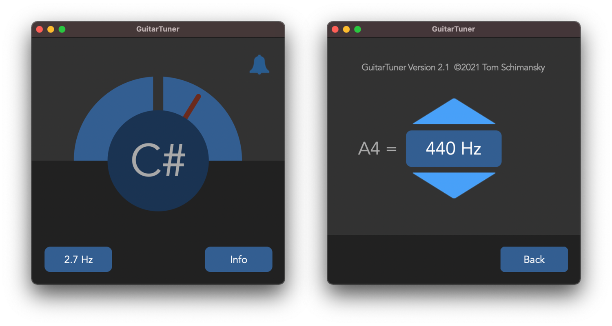

# GuitarTuner App

This is a simple **guitar tuner** program written in Python with Tkinter, PyAudio and NumPy.
The played note is automatically recognized through the microphone, and an acoustic signal is
heard when the tuning is correct. If you want you can also change the reference-tone to another
frequency.

**Download macOS app:** https://github.com/TomSchimansky/GuitarTuner/releases/tag/3.0

### Functionality

The app uses PyAudio to get access to the raw audio-stream coming from the microphone.
Then a **fast-fourier-transformation** (```numpy.fft```) is applied on the audio-data, which is buffered for about 1.5 seconds.
From the fft output, you can get the loudest frequency and convert it to a musical note by applying the following
formula: ```12 * numpy.log2(f / a4_frequency) + 69```.

### Run GuitarTuner with python
First you need to install all necessary libraries:
```
pip3 install -r requirements.txt
```
Then you can do:
```
python3 main.py
```
Note that macOS dark-mode **only** works with **anaconda** python version.

So the preferred way to run the program would be with anaconda-python (you have to install miniconda):

```
conda activate base
pip install -r requirements.txt
python main.py
   ...
conda deactivate
```

Install miniconda python version: https://docs.conda.io/en/latest/miniconda.html

### Create standalone application
You can also create a standalone application for macOS or Windows by yourself. For macOS you can use py2app:
```
python3.8 setup.py py2app
```
For windows, you would need to use py2exe instead and modify the setup.py file.

To keep application size as small as possible, make sure you create a virtual environment where you install
only the necessary libraries. The macOS dark-mode currently **only** works with the **anaconda python** Version.
If you compile the app with a python.org version, you have to disable the dark-mode by deleting
the ```'NSRequiresAquaSystemAppearance': False```entry in setup.py, which causes the application window to go
into dark-mode.

